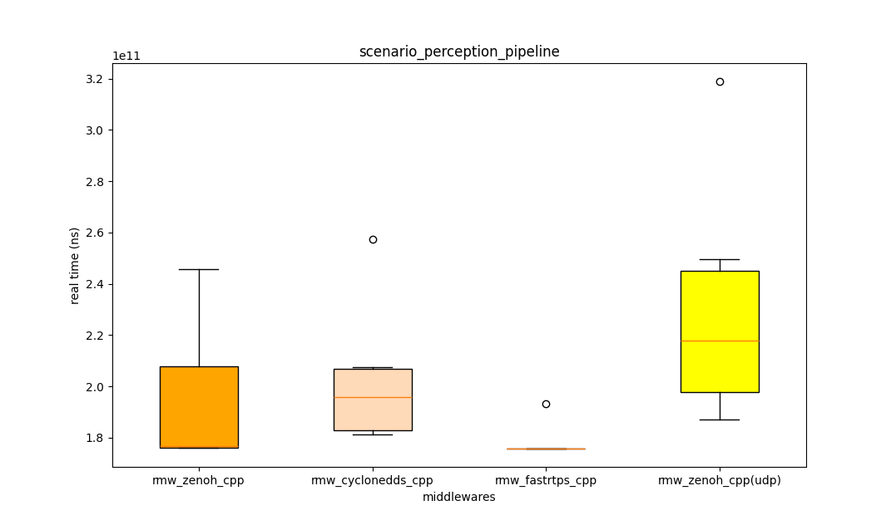

We've completed our project titled "Zenoh Support & Benchmarking". With this project, we could try to understand how to be used rmw_zenoh in MoveIt2 project and how rmw_zenoh affects MoveIt2's workflow.

## Movitation

The aims of this Google Summer of Code Project was to make [rmw_zenoh_cpp](https://github.com/ros2/rmw_zenoh) enable for MoveIt2, benchmark the midlewares such as rmw_cyclonedds and rmw_fastrtps against some scenarios from complex robotic problems like trajectory planning and task planning to basic ROS works like basic topic subscription-publishing, service-client operations, report the found bugs to rmw_zenoh team and configure CI in a way that rmw_zenoh can be supported.

rmw_zenoh comes to the fore with some exciting features like configurability with elastic topologies, supporting a lot of protocol such as TCP, UDP and usable at WIFI networks compared to DDS based middlewares even though it's still in development phase.

## Progress
**Integration to Moveit2**

Even if we couldn't run moveit2 with rmw_zenoh due to data races inside `rmw_wait` function in the starting of GSoC project, which bring about some problems in Multithreaded Executor, we could run MoveIt2 with rmw_zenoh after some bug-fixes for `rmw_wait` function in the middle of GSoC project period. Even if rmw_zenoh has some problems and is in development progress, you can run MoveIt2 using rmw_zenoh middleware. Additionally, rmw_zenoh has some pretty good potential so that you can get approximately as same performance as rmw_fastrtps even if rmw_zenoh is used TCP protocol by default, you can help for rmw_zenoh team to completed and find the bugs!

**Benchmarking**

During this summer, the middleware benchmarking tool is created to compare the middlewares such as rmw_zenoh, rmw_cyclonedds and rmw_fastrtps. Some scenarios are implemented for measuring how the middlewares affect in some scenarios in robotics. Here is our middleware benhmarking tool : [moveit_middleware_bechmark](https://github.com/CihatAltiparmak/moveit_middleware_benchmark).

Some of scenarios are:

- Basic Service-Client Works
- Basic Topic Subscription-Publishing
- Perception Pipeline
- MoveIt Task Constructor

**Bugs in rmw_zenoh**

It's also reported some bugs in a case of catching it. These are

- https://github.com/ros2/rmw_zenoh/issues/257
- https://github.com/ros2/rmw_zenoh/issues/240
- https://github.com/ros2/rmw_zenoh/issues/251
- https://github.com/ros2/rmw_zenoh/issues/186

It's also contributed to rmw_zenoh.

- https://github.com/ros2/rmw_zenoh/pull/252
- https://github.com/ros2/rmw_zenoh/pull/255
- https://github.com/ros2/rmw_zenoh/pull/256

**Conducting Benchmarks in CI**

Additionally, the website for visualization of benchmark results created so that it's also configurable with CI.

Finally, the benchmarks have been conducted in a way to give the reliable comparisons in github-actions and the results are visualized in website.

**Contributions to MoveIt During GSoC Project
- https://github.com/moveit/moveit2/pull/2963
- https://github.com/moveit/moveit2/pull/2834
- https://github.com/moveit/moveit2_tutorials/pull/906
- https://github.com/moveit/moveit2_tutorials/pull/944

## Achievements

We have benchmarked the middlewares against various scenarios and we have found below benchmark results. We have used default configurations of rmw_zenoh except the fact that we configured some tcp settings like below:

```sh
sudo sysctl -w "net.ipv4.tcp_rmem=4096 4096 4096"
sudo sysctl -w "net.ipv4.tcp_wmem=4096 4096 4096"
sudo sysctl -w "net.ipv4.tcp_mem=4096 4096 4096"
```




## Additional

The heartfelt thank you goes to my mentors [Sebastian Jahr](https://github.com/sjahr) and [Henning Kayser](https://github.com/henningkayser). An other thanks goes to [Julien Enoch](https://github.com/JEnoch) and [Zenoh Community](https://zenoh.io/community/) for trying our middleware benchmark tool and giving valuable feedbacks to us. Without valuable helps of [Zenoh Community](https://zenoh.io/community/), we couldn't complete this project.
